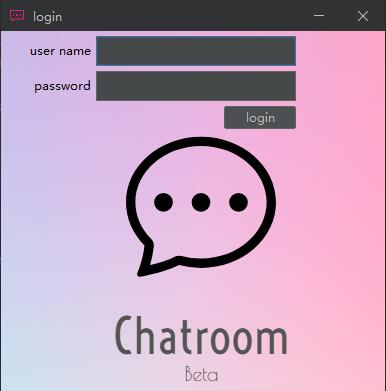
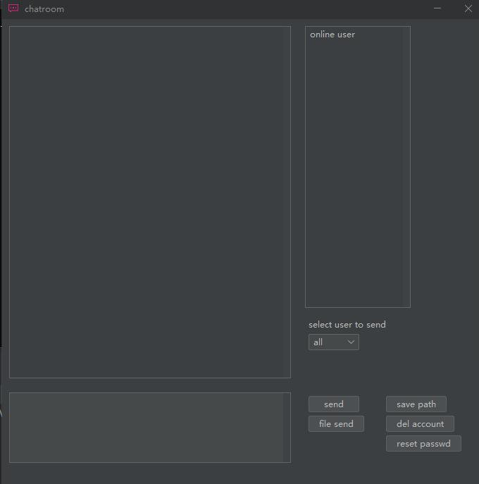

# Chatroom

#### 介绍
1. 该仓库为基于socket的C++多线程聊天室实现, mult chatroom/mult chatroom gui为支持多人通信的聊天室实现, single chatroom仅支持一对一通信. (此后更新均针对mult chatroom 及 mult chatroom gui)
2. 更新日志见Log.md.
3. mult chatroom中的client需开启C++17标准的支持.
4. mult chatroom gui中的swing项目部分需要添加flatlaf依赖, 图片和依赖包资源以及dll在mult chatroom gui/src下.

#### 架构:
1. chatroom_client/chatroom_server: 聊天室的实现, 其中包含chatroom_base类及子类chatroom_client/server; chatroom_base类的作用是初始化WSA和socket, 而子类负责聊天室的主要业务.
2. chatroom_account: 账号及其相关机制的实现.
3. server_account/client_account: 登录机制的相互通信实现. 
4. client/server : 对chatroom_client/chatroom_server的调用.
5. client/server_command : 指令系统实现.
6. client/server_file_transport : 文件传输系统实现.
7. thread_pool : 线程池.
8. chatroom_gui.java : mult chatroom gui中swing前端的实现.
9. string_convert : jstring与string间转换.
10. error_log : 错误日志实现.

#### 命令:
1. /exit : client端为退出; server端为退出当前通信, 但不关闭进程, 而是等待下一次连接.
2. /filesd : 发送文件至对方本地.
3. /filept : 修改文件保存路径.
4. /passwd : 修改账号密码.
5. /accdel : 删除账号.
6. /p : 私聊 (仅在mult chatroom中使用).
在终端使用/help可查看命令帮助, 在mult chatroom中server不支持指令.

#### mult chatroom gui效果:

##### ip地址输入界面
 

##### 登录界面
 

##### 聊天主界面

#### 最近更新:
##### 2022/7/17
1. 针对mult chatroom客户端的信息收发多线程部分进行了优化.

